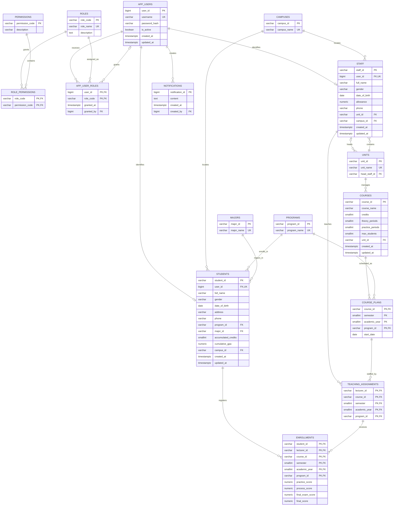

# PostgreSQL database design

This design replaces the Oracle-specific model with a PostgreSQL schema named
`university`. It preserves the existing university domain while moving identity
and authorization into the API.



## Authentication and authorization

`app_users` is the sole authentication table. It stores a BCrypt hash and an
active flag. Roles are normalized through `app_user_roles`; permissions are
granted through `role_permissions`. `staff` and `students` each have a
one-to-one link to `app_users` and deliberately contain no duplicate role
column. The API connects to PostgreSQL with one application connection string;
it must not create a PostgreSQL server account for every student or staff
member.

The initial role codes are `BASIC_STAFF`, `LECTURER`, `ACADEMIC_AFFAIRS`,
`UNIT_HEAD`, `DEAN`, and `STUDENT`. The script also seeds the permission
catalogue and role-to-permission mapping. API authorization will load those
permissions into JWT claims. The request identity is initialized by
`02_security_context.sql`; later RLS policies can use its identity and
permission helpers without trusting IDs supplied in repository queries.

## Apply locally

Start the container first, then run the schema as the `postgres` database user:

```powershell
docker compose -f script/docker-compose.postgres.yml up -d
Get-Content script/postgres/01_schema.sql | docker exec -i university-postgres psql -U postgres -d university_management -v ON_ERROR_STOP=1
Get-Content script/postgres/02_security_context.sql | docker exec -i university-postgres psql -U postgres -d university_management -v ON_ERROR_STOP=1
Get-Content script/postgres/02_verify_security_context.sql | docker exec -i university-postgres psql -U postgres -d university_management -v ON_ERROR_STOP=1
Get-Content script/postgres/03_enable_student_rls.sql | docker exec -i university-postgres psql -U postgres -d university_management -v ON_ERROR_STOP=1
Get-Content script/postgres/03_verify_student_rls.sql | docker exec -i university-postgres psql -U postgres -d university_management -v ON_ERROR_STOP=1
Get-Content script/postgres/04_student_select_policies.sql | docker exec -i university-postgres psql -U postgres -d university_management -v ON_ERROR_STOP=1
Get-Content script/postgres/04_verify_student_select_policies.sql | docker exec -i university-postgres psql -U postgres -d university_management -v ON_ERROR_STOP=1
Get-Content script/postgres/05_student_write_policies.sql | docker exec -i university-postgres psql -U postgres -d university_management -v ON_ERROR_STOP=1
Get-Content script/postgres/05_verify_student_write_policies.sql | docker exec -i university-postgres psql -U postgres -d university_management -v ON_ERROR_STOP=1
Get-Content script/postgres/06_staff_self_service_policies.sql | docker exec -i university-postgres psql -U postgres -d university_management -v ON_ERROR_STOP=1
Get-Content script/postgres/06_verify_staff_self_service_policies.sql | docker exec -i university-postgres psql -U postgres -d university_management -v ON_ERROR_STOP=1
Get-Content script/postgres/07_lecturer_policies.sql | docker exec -i university-postgres psql -U postgres -d university_management -v ON_ERROR_STOP=1
Get-Content script/postgres/07_verify_lecturer_policies.sql | docker exec -i university-postgres psql -U postgres -d university_management -v ON_ERROR_STOP=1
Get-Content script/postgres/08_academic_affairs_assignment_policies.sql | docker exec -i university-postgres psql -U postgres -d university_management -v ON_ERROR_STOP=1
Get-Content script/postgres/08_verify_academic_affairs_assignment_policies.sql | docker exec -i university-postgres psql -U postgres -d university_management -v ON_ERROR_STOP=1
Get-Content script/postgres/09_academic_affairs_enrollment_maintenance.sql | docker exec -i university-postgres psql -U postgres -d university_management -v ON_ERROR_STOP=1
Get-Content script/postgres/09_verify_academic_affairs_enrollment_maintenance.sql | docker exec -i university-postgres psql -U postgres -d university_management -v ON_ERROR_STOP=1
Get-Content script/postgres/10_unit_head_assignment_policies.sql | docker exec -i university-postgres psql -U postgres -d university_management -v ON_ERROR_STOP=1
Get-Content script/postgres/10_verify_unit_head_assignment_policies.sql | docker exec -i university-postgres psql -U postgres -d university_management -v ON_ERROR_STOP=1
Get-Content script/postgres/11_dean_global_policies.sql | docker exec -i university-postgres psql -U postgres -d university_management -v ON_ERROR_STOP=1
Get-Content script/postgres/11_verify_dean_global_policies.sql | docker exec -i university-postgres psql -U postgres -d university_management -v ON_ERROR_STOP=1
```

The script first executes `DROP SCHEMA university CASCADE`, so it recreates the
schema from scratch and permanently deletes all data in that schema. It seeds
only stable reference data and the RBAC catalogue; demo users and university
data are separate follow-up steps.

The verification script creates temporary staff and student identities, tests
identity, role, and permission resolution, and finishes with `ROLLBACK`. A
successful run prints `security context verification passed`.

`03_enable_student_rls.sql` enables row-level security on `students`,
`course_plans`, and `enrollments`. PostgreSQL uses default-deny behavior for a
non-owner role when RLS is enabled without a matching policy. The next
migration must add explicit policies before the restricted API role receives
access to these tables. A successful verification prints
`student RLS enablement verification passed`.

`04_student_select_policies.sql` adds the first explicit RLS policies. A
student can read only their own `students` row, course plans for their own
program, and their own enrollments. The verification uses two students in
different programs and also tests a missing security context. A successful run
prints `student SELECT policy verification passed`.

`05_student_write_policies.sql` permits students to update only their own
contact information and to create or delete only their own enrollments from
the course-plan start date through 14 days afterward. Program matching and the
database-date registration window are enforced by RLS. The restricted API role
must also use column-level grants so protected student and enrollment score
columns cannot be supplied:

```sql
GRANT SELECT ON university.students, university.course_plans,
    university.enrollments TO university_api;
GRANT UPDATE (address, phone) ON university.students TO university_api;
GRANT INSERT (
    student_id, lecturer_id, course_id, semester, academic_year, program_id
) ON university.enrollments TO university_api;
GRANT DELETE ON university.enrollments TO university_api;
```

The verification covers allowed writes, cross-student denial, protected-column
denial, score-column denial, missing-context denial, and open/closed
registration windows. A successful run prints
`student write policy verification passed`.

`06_staff_self_service_policies.sql` enables RLS on `staff` and implements the
common CS#1 scope inherited by every staff role. Staff can read only their own
profile, update only their own phone, and read all students and course plans.
Use column-level privileges for the restricted API role:

```sql
GRANT SELECT ON university.staff, university.students,
    university.course_plans TO university_api;
GRANT UPDATE (phone) ON university.staff TO university_api;
```

The rollback-only verification covers own-profile access, read-all academic
data, own-phone updates, cross-staff and protected-column denial, preservation
of student isolation, and missing-context fail-closed behavior. A successful
run prints `staff self-service policy verification passed`.

`07_lecturer_policies.sql` enables RLS on `teaching_assignments`. Lecturers can
read only their own assignments and the enrollments attached to them, and can
update only score columns for those enrollments. The API role needs:

```sql
GRANT SELECT ON university.teaching_assignments, university.enrollments
    TO university_api;
GRANT UPDATE (
    practice_score, process_score, final_exam_score, final_score
) ON university.enrollments TO university_api;
```

The verification covers assigned and unassigned rows, score updates,
protected-key denial, preservation of student enrollment isolation, and
missing-context fail-closed behavior. A successful run prints
`lecturer policy verification passed`.

`08_academic_affairs_assignment_policies.sql` adds the CS#3 faculty-office
scope to the protected assignment table. Academic Affairs can read and update
all teaching assignments, while lecturer access remains self-scoped. The API
role needs `SELECT, UPDATE` on `university.teaching_assignments`; RLS still
requires the authenticated user to hold the matching permission.

The verification covers read-all access, assignment reassignment, lecturer
self-scope after reassignment, lecturer update denial, and missing-context
fail-closed behavior. A successful run prints
`Academic Affairs assignment policy verification passed`.

`09_academic_affairs_enrollment_maintenance.sql` implements the CS#3 rule that
Academic Affairs may add or remove an enrollment on a student's request only
while registration is open. Trusted definer-rights functions enforce the
`ENROLLMENT_CREATE_DELETE_ALL` permission, student/program consistency, and
the course-plan start-date-through-14-days window. Their signatures omit score
columns, and the API role receives function execution without direct
`SELECT`, `INSERT`, or `DELETE` privileges on `enrollments`:

```sql
GRANT EXECUTE ON FUNCTION university.create_enrollment_for_student(
    varchar, varchar, varchar, smallint, smallint, varchar
) TO university_api;
GRANT EXECUTE ON FUNCTION university.delete_enrollment_for_student(
    varchar, varchar, varchar, smallint, smallint, varchar
) TO university_api;
```

The verification covers allowed open-window creation/deletion, closed-window
denial, program mismatch, absence of direct table privileges, unauthorized
roles, and missing-context denial. A successful run prints
`Academic Affairs enrollment maintenance verification passed`.

`10_unit_head_assignment_policies.sql` implements CS#4. A Unit Head can read
assignments of lecturers belonging to their unit, but can create, update, or
delete assignments only for courses managed by their unit.
New or changed lecturers must hold an active teaching role. The API role needs
`SELECT, INSERT, UPDATE, DELETE` on `university.teaching_assignments`; RLS
enforces the authenticated Unit Head's organizational scope.

The verification distinguishes lecturer-unit visibility from course-unit
management, confirms course ownership alone does not widen reads, tests
allowed create/update/delete operations, rejects management
of another unit's courses and non-teaching staff, and confirms missing-context
fail-closed behavior. A successful run prints
`Unit Head assignment policy verification passed`.

`11_dean_global_policies.sql` implements the first CS#5 slice. The Dean can
read every row in all currently RLS-protected tables and can create, update,
or delete teaching assignments faculty-wide. New or changed lecturers must
still hold an active teaching role. The restricted API role needs the same
table privileges used by the protected read and assignment workflows; RLS
requires the Dean's `DATABASE_READ_ALL` or `ASSIGNMENT_MANAGE_OFFICE`
permission.

The verification covers global visibility, faculty-wide assignment DML,
non-teaching-staff denial, preservation of lecturer isolation, and
missing-context fail-closed behavior. A successful run prints
`Dean global policy verification passed`.

## API transaction contract

For every authenticated request that accesses protected data, the API must:

1. Open a PostgreSQL transaction.
2. Call `university.set_security_context(@userId)` using the authenticated
   server-side user ID.
3. Execute every repository command on the same connection and transaction.
4. Commit or roll back the transaction.

The context is transaction-local, so it is cleared automatically before a
pooled connection can serve another request. Do not initialize it outside a
transaction. When the restricted API database role is created, grant only:

```sql
GRANT USAGE ON SCHEMA university TO university_api;
GRANT EXECUTE ON FUNCTION university.set_security_context(bigint)
    TO university_api;
```

The API must never accept `userId` directly from a request body, query string,
or other client-controlled input.
