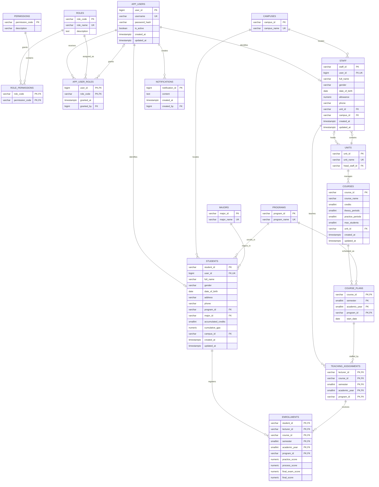

# PostgreSQL database design

This design replaces the Oracle-specific model with a PostgreSQL schema named
`university`. It preserves the existing university domain while moving identity
and authorization into the API.



## Authentication and authorization

`app_users` is the sole authentication table. It stores a BCrypt hash and an
active flag. Roles are normalized through `app_user_roles`; permissions are
granted through `role_permissions`. `staff` and `students` each have a
one-to-one link to `app_users` and deliberately contain no duplicate role
column. The API connects to PostgreSQL with one application connection string;
it must not create a PostgreSQL server account for every student or staff
member.

The initial role codes are `BASIC_STAFF`, `LECTURER`, `ACADEMIC_AFFAIRS`,
`UNIT_HEAD`, `DEAN`, and `STUDENT`. The script also seeds the permission
catalogue and role-to-permission mapping. API authorization will load those
permissions into JWT claims. The request identity is initialized by
`02_security_context.sql`; later RLS policies can use its identity and
permission helpers without trusting IDs supplied in repository queries.

## Apply locally

Start the container first, then run the schema as the `postgres` database user:

```powershell
docker compose -f script/docker-compose.postgres.yml up -d
Get-Content script/postgres/01_schema.sql | docker exec -i university-postgres psql -U postgres -d university_management -v ON_ERROR_STOP=1
Get-Content script/postgres/02_security_context.sql | docker exec -i university-postgres psql -U postgres -d university_management -v ON_ERROR_STOP=1
Get-Content script/postgres/02_verify_security_context.sql | docker exec -i university-postgres psql -U postgres -d university_management -v ON_ERROR_STOP=1
```

The script first executes `DROP SCHEMA university CASCADE`, so it recreates the
schema from scratch and permanently deletes all data in that schema. It seeds
only stable reference data and the RBAC catalogue; demo users and university
data are separate follow-up steps.

The verification script creates temporary staff and student identities, tests
identity, role, and permission resolution, and finishes with `ROLLBACK`. A
successful run prints `security context verification passed`.

## API transaction contract

For every authenticated request that accesses protected data, the API must:

1. Open a PostgreSQL transaction.
2. Call `university.set_security_context(@userId)` using the authenticated
   server-side user ID.
3. Execute every repository command on the same connection and transaction.
4. Commit or roll back the transaction.

The context is transaction-local, so it is cleared automatically before a
pooled connection can serve another request. Do not initialize it outside a
transaction. When the restricted API database role is created, grant only:

```sql
GRANT USAGE ON SCHEMA university TO university_api;
GRANT EXECUTE ON FUNCTION university.set_security_context(bigint)
    TO university_api;
```

The API must never accept `userId` directly from a request body, query string,
or other client-controlled input.
